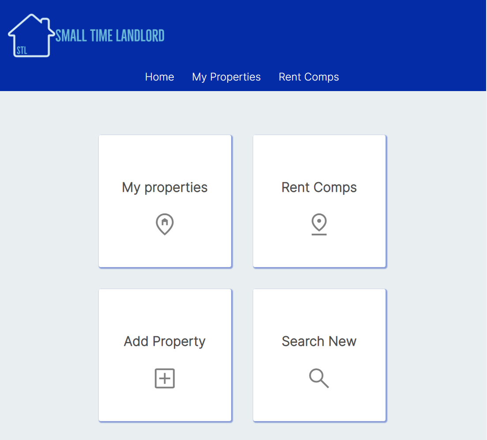

# Small Time Landlord Application

An application for just getting started landlords. The front-end was built in Angular and the back-end with Spring boot. This application allows you to track your properties and tenant information. It also allows for rental comparison for properties clsoe to your units on the Rent Comp page.

[Back-end Repo](ttps://github.com/saraiba33/property-manager-backend.git)

[Deployed app](https://small-time-landlord.netlify.app/)

